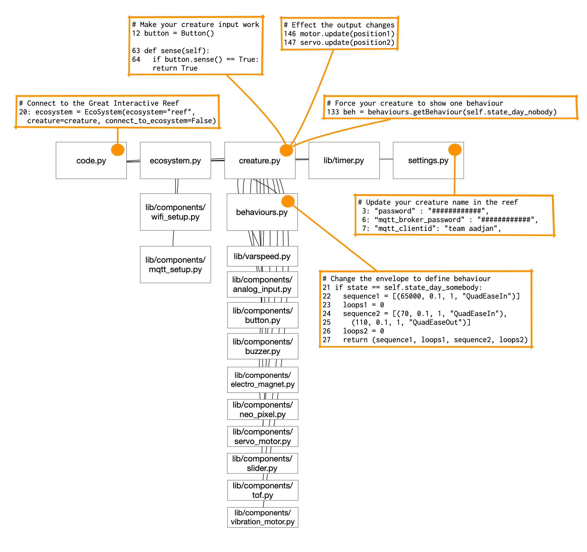
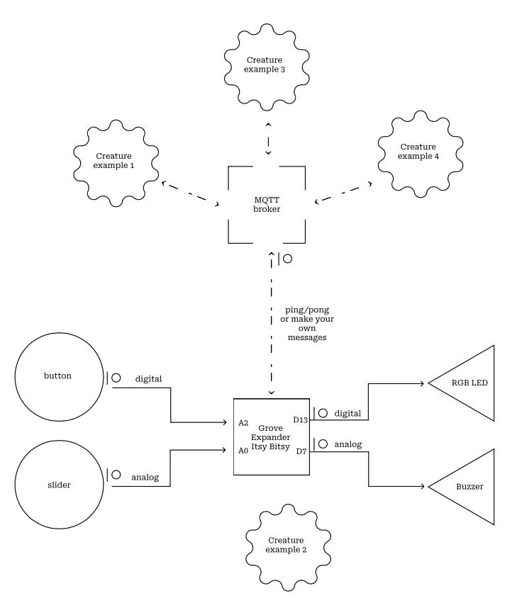
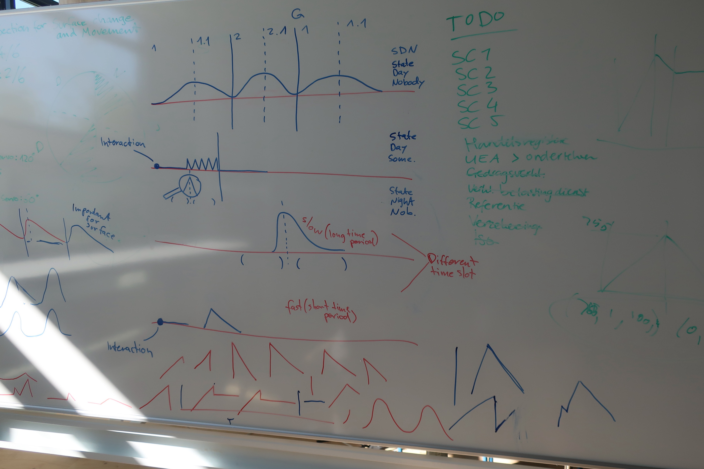

# Robot Among Us - Raspberry Pi Pico 2W Port

This is a port of the Great Interactive Reef project to the Raspberry Pi Pico 2W board. The original project was designed for the ItsyBitsy M4 with an ESP32 SPI co-processor for WiFi connectivity. This port modifies the code to use the Pico 2W's built-in WiFi capabilities.

## Pin Assignments

The following pin assignments have been updated for the Raspberry Pi Pico 2W:

| Component       | Original ItsyBitsy M4 Pin | Pico 2W Pin |
|-----------------|---------------------------|-------------|
| Button          | A2                        | GP16        |
| Servo Motor     | D4                        | GP15        |
| Vibration Motor | D2                        | GP14        |
| NeoPixel LED    | D13                       | GP13        |
| Buzzer          | D7                        | GP17        |

## Connectivity Changes

- The WiFi connection now uses the built-in WiFi module of the Pico 2W instead of the ESP32 SPI interface
- MQTT connectivity has been updated to work with the Pico 2W's networking stack
- No additional hardware is needed for WiFi connectivity

## Usage

1. Upload the code to your Raspberry Pi Pico 2W board with CircuitPython installed
2. Update the `settings.py` file with your WiFi and MQTT credentials
3. Connect the components to the appropriate pins as listed above
4. Power the Pico 2W and it should connect to WiFi and the MQTT broker automatically

## Original Project Documentation

The rest of this document contains the original project documentation.

# Guide into the code

## Connect components

The components should connect to specific pins on the Raspberry Pi Pico 2W to make it work out of the box.

## Code Map

This code map shows the most relevant code files. It highlights those files and lines of code where that will have to be changed to adapt the code template to the specific creature you are designing.

[GIR creature code map.pdf](guide_into_the_code/GIR_creature_code_map.pdf)

## System Diagram

This System Diagram is drawn in the visual style that is mandatory in the Interactive Environments minor. You can find more about it in our Knowledge Gallery for if you want to create a system diagram for your creature. On the Interactive Technology day we focus on designing the technology of one creature, so the network connection is not active at first.

A depiction of the Great Interactive Reef system that will be exhibited at the end of the Interaction Studies Course. It shows one creature in detail (Creature example 2) and the network connection to the MQTT broker and the other Reef Creatures.

## What do we mean with an Envelope?

[Envelope (music)](https://en.wikipedia.org/wiki/Envelope_(music))

## Specifying Envelopes in CircuitPython

[https://github.com/pvanallen/VarSpeedPython](https://github.com/pvanallen/VarSpeedPython)

[Easing Functions Cheat Sheet](https://easings.net/)